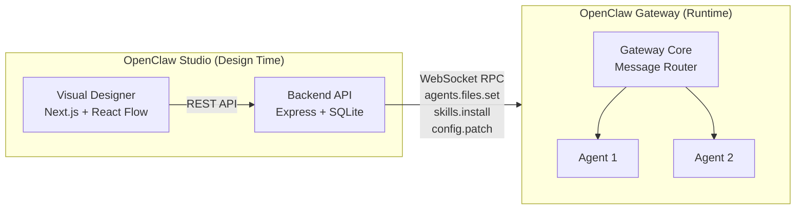
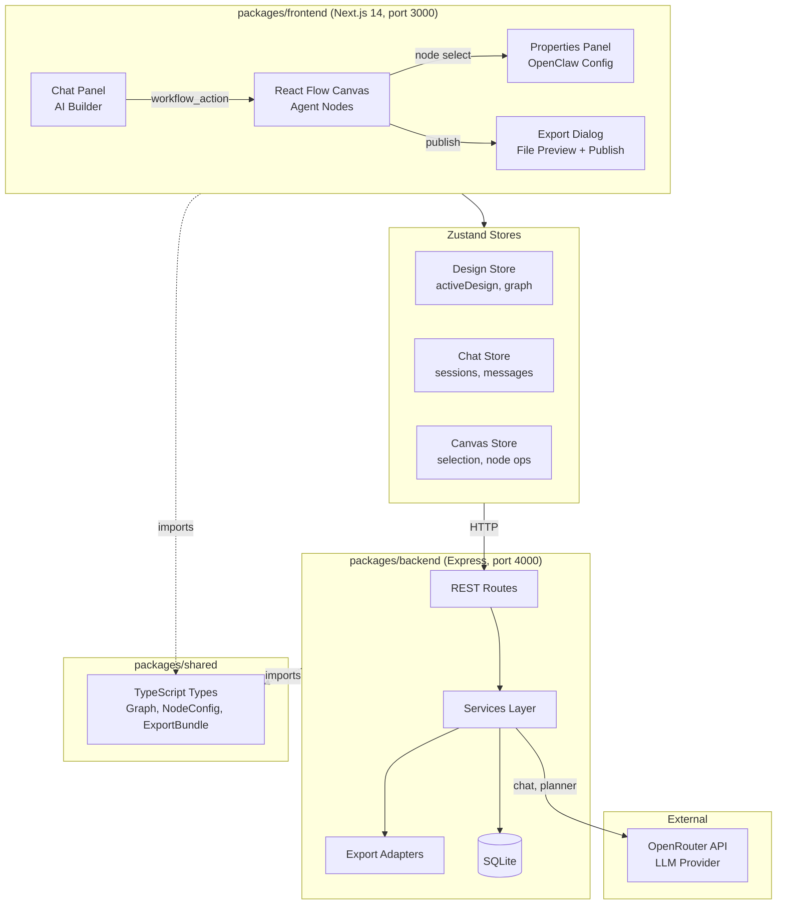
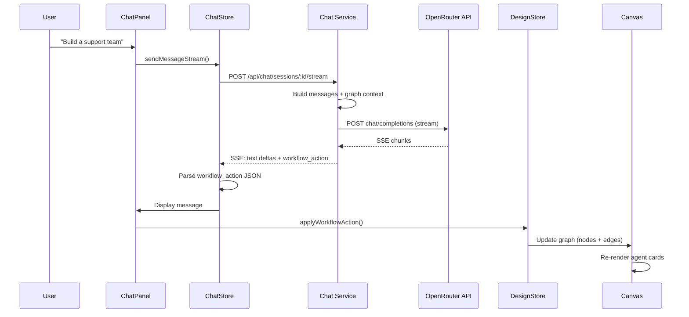
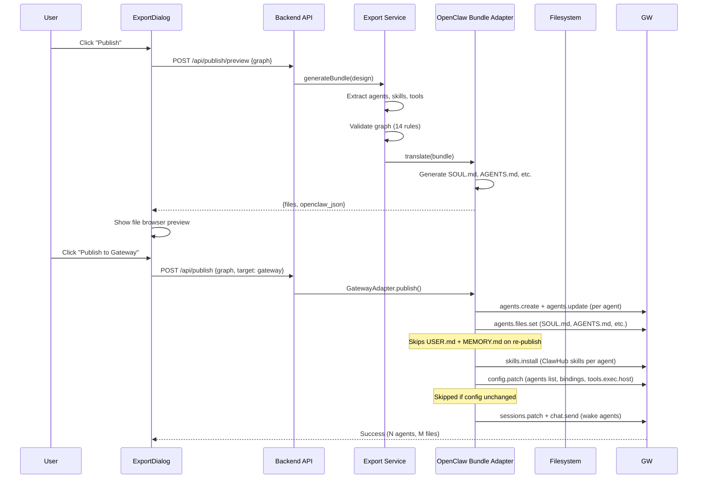
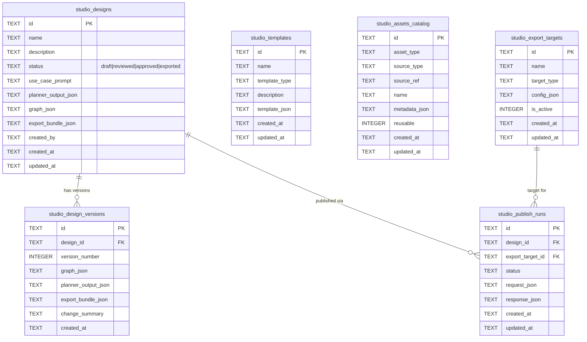
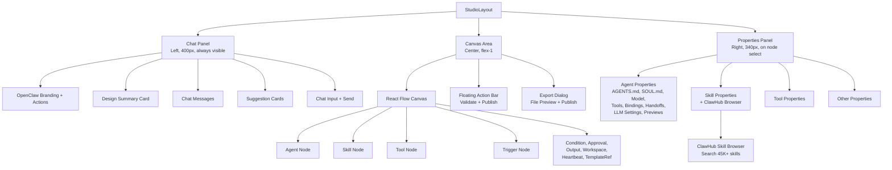
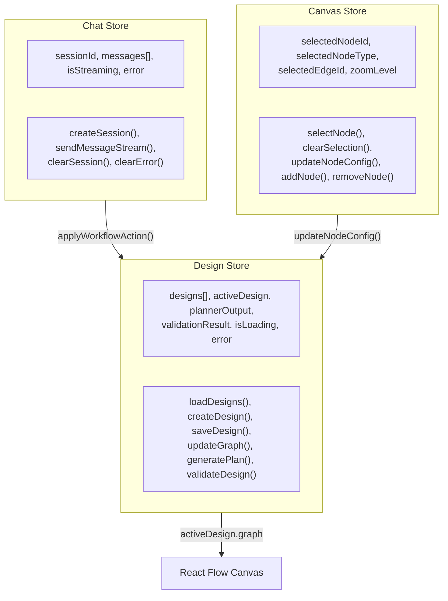
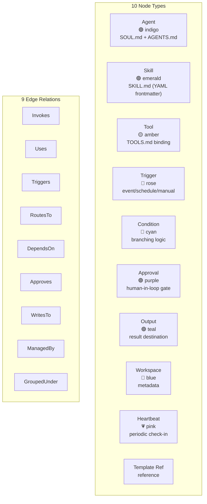
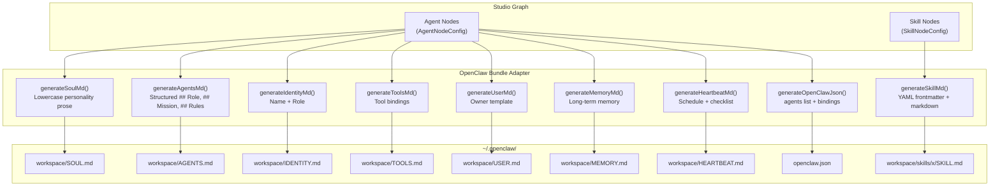
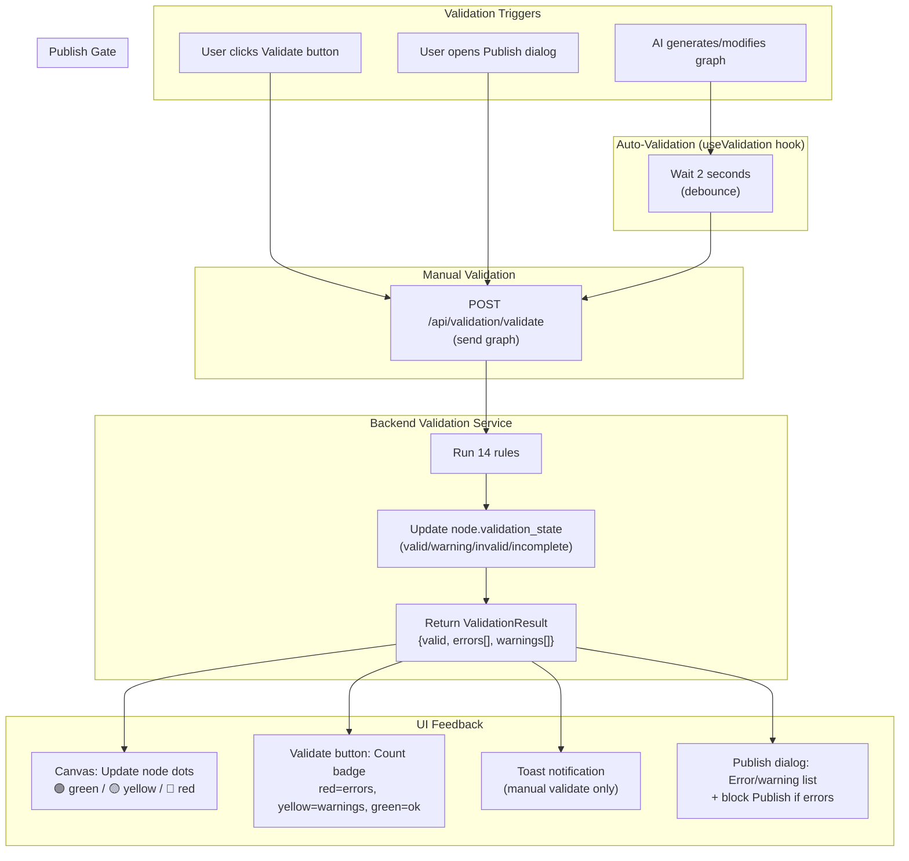

# OpenClaw Studio — Architecture

## System Overview

OpenClaw Studio is a **design-time visual designer** for OpenClaw multi-agent systems. It generates workspace files (`SOUL.md`, `AGENTS.md`, `openclaw.json`, etc.) that the OpenClaw gateway reads at startup. **It is not a runtime.**



---

## High-Level Architecture



---

## Data Flow

### 1. AI Chat → Canvas Flow



### 2. Publish Flow



---

## Backend Architecture

### Route → Service → Adapter Stack

```mermaid
graph LR
    subgraph Routes
        R1[/api/designs]
        R2[/api/planner]
        R3[/api/chat]
        R4[/api/validation]
        R5[/api/publish]
        R6[/api/export]
    end

    subgraph Services
        S1[Design Service]
        S2[Planner Service]
        S3[Chat Service]
        S4[Validation Service]
        S5[Export Service]
    end

    subgraph Adapters
        A1[Filesystem Adapter]
        A2[OpenClaw Bundle Adapter]
        A3[Git Adapter]
        A4[Gateway Direct Adapter]
    end

    subgraph GatewayRPC ["Gateway WebSocket RPC"]
        GW[Gateway WS Client<br/>Protocol v3]
    end

    R1 --> S1
    R2 --> S2
    R3 --> S3
    R4 --> S4
    R5 --> S5
    R6 --> S5

    S5 --> A1
    S5 --> A2
    S5 --> A3
    S5 --> A4

    A1 -->|delegates| A2
    A3 -->|delegates| A1
    A4 -->|delegates| A2
    A4 -->|"agents.files.set<br/>skills.install<br/>config.patch"| GW

    S1 --> DB[(SQLite)]
    S3 --> OR[OpenRouter API]
    S2 --> OR
```

### API Endpoints

| Method | Path | Service | Description |
|--------|------|---------|-------------|
| GET | `/api/designs` | Design | List all designs |
| POST | `/api/designs` | Design | Create design |
| GET | `/api/designs/:id` | Design | Get design |
| PUT | `/api/designs/:id` | Design | Update design |
| DELETE | `/api/designs/:id` | Design | Delete design |
| GET | `/api/designs/:id/versions` | Design | List versions |
| POST | `/api/designs/:id/versions` | Design | Save version snapshot |
| POST | `/api/planner/generate` | Planner | Generate agents from prompt |
| POST | `/api/planner/refine` | Planner | Refine existing plan |
| POST | `/api/chat/sessions` | Chat | Create chat session |
| POST | `/api/chat/sessions/:id/messages` | Chat | Send message (non-streaming) |
| POST | `/api/chat/sessions/:id/stream` | Chat | Send message (SSE streaming) |
| DELETE | `/api/chat/sessions/:id` | Chat | Delete session |
| POST | `/api/validation/validate` | Validation | Validate graph (14 rules) |
| GET | `/api/validation/rules` | Validation | List validation rules |
| POST | `/api/export/bundle` | Export | Generate export bundle |
| POST | `/api/publish` | Export + Adapter | Publish to target |
| POST | `/api/publish/preview` | Export + Adapter | Preview workspace files |
| GET | `/api/publish/targets` | Publish | List export targets |
| POST | `/api/publish/gateway/skills/search` | Gateway RPC | Search ClawHub skills via gateway |
| POST | `/api/publish/gateway/skills/list` | Gateway RPC | List installed skills on gateway |
| POST | `/api/publish/gateway/skills/install` | Gateway RPC | Install a ClawHub skill on gateway |
| GET | `/api/health` | — | Health check |

---

## Database Schema



---

## Frontend Architecture

### Component Tree



### Zustand Store Architecture



---

## Node Type System



---

## Gateway WebSocket RPC

Studio communicates with the OpenClaw Gateway using WebSocket RPC (protocol v3). The `gateway-rpc.ts` service handles connection, authentication, and message exchange.

### Authentication Modes

| Mode | Client ID | When Used | Requirements |
|------|-----------|-----------|-------------|
| **Device** (default) | `gateway-client` | `~/.openclaw/identity/device.json` exists | Ed25519 device keys (paired device) |
| **Token** | `openclaw-control-ui` | Fallback when no device keys | `controlUi.allowInsecureAuth` on gateway |
| **Auto** | — | Default behavior | Tries device first, falls back to token |

### RPC Methods Used

| Method | Step | Purpose |
|--------|------|---------|
| `health` | Pre-check | Verify gateway is reachable |
| `agents.create` | Provisioning | Create agent workspace directory |
| `agents.update` | Provisioning | Register agent name + workspace path |
| `agents.files.set` | Provisioning | Push workspace files (SOUL.md, AGENTS.md, etc.) |
| `skills.search` | Skill Browser | Search ClawHub registry for skills |
| `skills.install` | Provisioning | Install ClawHub skill for an agent |
| `config.get` | Config | Read current openclaw.json + hash |
| `config.patch` | Config | Update agents list, bindings, tools.exec.host |
| `sessions.patch` | Wake | Ensure agent session exists |
| `chat.send` | Wake | Send bootstrap message to start agent |

### Smart Re-publish Behavior

- **USER.md and MEMORY.md** are skipped on re-publish (agent already exists) to preserve user data and agent memories
- **config.patch** is skipped if the config is unchanged (avoids gateway restarts that rotate agent tokens)
- **tools.exec.host: "gateway"** is added only if not already set (won't override user's choice)

---

## OpenClaw Workspace File Generation



---

## Validation Flow

Validation runs at three points — silently after AI changes, on manual trigger, and as a gate before publish:



### Validation State on Nodes

Each node on the canvas shows a colored validation dot:

| State | Color | Meaning |
|-------|-------|---------|
| `valid` | Green | All checks passed |
| `warning` | Yellow | Has warnings (non-blocking) |
| `invalid` | Red | Has errors (blocks publish) |
| `incomplete` | Gray | Not yet validated |

---

## Validation Rules

14 rules run before export:

| # | Rule ID | Severity | Check |
|---|---------|----------|-------|
| 1 | `agent-has-name` | error | Agent must have a name |
| 2 | `agent-has-goal` | error | Agent must have goal or description |
| 3 | `agent-has-role` | error | Agent must have a role |
| 4 | `skill-has-purpose` | error | Skill must have a purpose |
| 5 | `skill-has-output` | warning | Skill should have output_schema |
| 6 | `tool-has-binding` | error | Tool must have binding_name |
| 7 | `tool-has-type` | error | Tool must have tool_type |
| 8 | `heartbeat-has-schedule` | error | Heartbeat must have schedule |
| 9 | `heartbeat-has-mode` | error | Heartbeat must have mode |
| 10 | `approval-has-rationale` | warning | Approval should have rationale |
| 11 | `graph-has-agent` | error | Graph must have at least 1 agent |
| 12 | `no-orphan-agents` | warning | Agents should have connections |
| 13 | `no-disconnected-tools` | warning | Tools should connect to agent/skill |
| 14 | `reused-asset-ref-present` | error | Reuse mode 'existing' needs reference |

---

## Tech Stack

| Layer | Technology | Purpose |
|-------|-----------|---------|
| Frontend | Next.js 14 | App framework |
| Canvas | React Flow v12 (@xyflow/react) | Visual node editor |
| State | Zustand | State management |
| Styling | Tailwind CSS | Utility-first CSS |
| Backend | Express.js | REST API server |
| Database | SQLite (better-sqlite3) | Persistent storage |
| AI | OpenRouter API | LLM for chat + planner |
| Types | TypeScript | Shared type system |
| Monorepo | npm workspaces | Package management |

---

## Directory Structure

```
openclaw-studio/
├── docs/                          # Documentation
├── packages/
│   ├── shared/                    # Shared TypeScript types
│   │   └── src/
│   │       ├── index.ts           # Barrel export
│   │       └── schemas/           # Type definitions
│   │           ├── graph.ts       # StudioGraph, StudioNode, enums
│   │           ├── node-configs.ts # AgentNodeConfig, SkillNodeConfig, etc.
│   │           ├── design.ts      # StudioDesign, ExportTarget
│   │           ├── planner.ts     # PlannerInput/Output, suggestions
│   │           ├── export-bundle.ts # AgentDefinition, ExportBundle
│   │           ├── validation.ts  # ValidationResult, rules
│   │           └── adapter.ts     # IExportAdapter, PublishResult
│   │
│   ├── backend/                   # Express API (port 4000)
│   │   └── src/
│   │       ├── index.ts           # Entry point, route mounting
│   │       ├── config.ts          # Environment config
│   │       ├── db/                # SQLite setup + migrations
│   │       ├── routes/            # REST endpoints (8 routers + gateway skill proxy)
│   │       ├── services/          # Business logic (7 services + gateway-rpc)
│   │       ├── adapters/          # Export adapters (4: filesystem, openclaw-bundle, git, gateway)
│   │       └── middleware/        # Error handler
│   │
│   └── frontend/                  # Next.js 14 (port 3000)
│       └── src/
│           ├── app/               # Next.js app router
│           ├── components/
│           │   ├── layout/        # StudioLayout (3-panel)
│           │   ├── canvas/        # React Flow canvas + 10 node types
│           │   ├── chat/          # AI chat panel + input
│           │   ├── properties/    # Node config editors (9 types) + ClawHub skill browser
│           │   ├── export/        # Export dialog with file preview
│           │   ├── common/        # Modal, Toast, Badge, ThemeToggle
│           │   ├── sidebar/       # Design list, templates, assets
│           │   ├── output/        # Validation, architecture reports
│           │   ├── prompt/        # Use case prompt (legacy)
│           │   └── versioning/    # Version history, diff
│           ├── store/             # Zustand stores (3)
│           ├── hooks/             # Custom React hooks
│           └── lib/               # API client, constants
│
└── packages/backend/data/             # SQLite database (auto-created)
```
